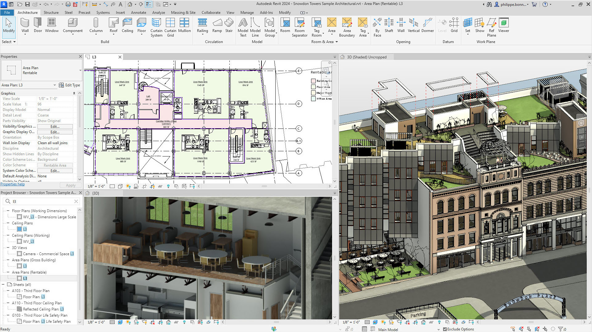

# Test title

## Test subtitle

This is a test sample paragraph to test the markdown file to InDesign workflow. Everyone should edit the source markdown file to collaborate, ensuring that all changes are tracked and version-controlled. No one should edit InDesign directly, as this can lead to inconsistencies and errors. By working together on the markdown file, we can ensure a smooth and efficient workflow. This approach also allows for easier review and approval of changes, making it an essential part of our collaborative process.

Revit is a powerful tool in the field of architecture, offering a wide range of features that can streamline the design and construction process. It is a Building Information Modeling (BIM) software, which means it is designed to create a digital representation of a building's physical and functional characteristics. This allows architects, engineers, and construction professionals to collaborate more effectively, reducing errors and improving efficiency.

### Subject 1

Subject 1 is a very important subject. the most important thing is that it is a very important subject. Below using a step by step instruction on how to bake a cake to isllustatre the importance of the subject.
- step 1: preheat the oven to 350°F (180°C)
- step 2: mix the dry ingredients (flour, sugar, baking powder, and salt) in a large bowl
- step 3: combine the wet ingredients (eggs, milk, and butter) in a separate bowl and whisk until smooth

BIM standard refers to the set of guidelines and best practices for using BIM software. It includes standards for data exchange, model creation, and project management. Adhering to BIM standards can help ensure consistency and interoperability across different projects and teams.

To use Revit effectively, it is important to understand its various tools and features, as well as the BIM standards that apply to your project. With the right knowledge and skills, Revit can be a valuable asset in the architecture and construction industry.

As we look towards the future, it is clear that Revit will continue to play a crucial role in the industry, especially as we approach the year 2025.

One of the key reasons why Revit will be important in 2025 is its ability to adapt to the changing needs of the industry. As technology continues to evolve, so too will the demands of architects, engineers, and construction professionals. Revit's flexibility and robust feature set make it well-positioned to meet these changing needs.

## Other Title

Another reason why Revit will be important in 2025 is its role in the growing trend towards sustainable design and construction. As the world grapples with the challenges of climate change, there is an increasing focus on sustainable building practices. Revit's ability to model and analyze the environmental impact of a building makes it an invaluable tool in this regard.

In addition to these reasons, Revit's role in the growing trend towards prefabrication and modular construction is another factor that will ensure its importance in 2025. As these methods become more common, the ability to accurately model and plan these types of projects will be essential, and Revit is well-equipped to handle this.

Overall, Revit's adaptability, its role in sustainable design, and its ability to handle the challenges of prefabrication and modular construction make it a tool that will continue to be important in the architecture industry in 2025.

# Test title

The Moon is Earth's sole natural satellite, orbiting our planet at an average distance of about 239,000 miles (384,000 kilometers). It is the fifth-largest moon in the solar system, with a diameter of approximately 2,159 miles (3,475 kilometers). The Moon is thought to have formed about 4.5 billion years ago, shortly after the formation of the Earth. One of the most widely accepted theories is that the Moon was created when a massive object collided with the early Earth, causing debris to be thrown into orbit and eventually coalesce into the Moon.

The Moon has a significant impact on Earth's tides, ocean currents, and the stability of Earth's axis. It is also responsible for the phases of the Moon, which are caused by the changing angle of the Sun's light as the Moon orbits the Earth. The Moon's surface is characterized by dark volcanic maria, which are visible from Earth as large, dark spots. These maria are filled with basalt, a type of volcanic rock that is rich in iron and magnesium.

The Moon has been an object of human fascination for centuries, with many cultures developing myths and legends about its origin and significance. In modern times, the Moon has been the subject of extensive scientific study, with numerous spacecraft visiting the Moon to collect data and conduct experiments. The most famous of these missions was the Apollo program, which successfully landed astronauts on the Moon's surface in the late 1960s and early 1970s.

Today, there is renewed interest in the Moon, with several countries and private companies planning to return humans to the Moon in the near future. The Moon is seen as a stepping stone for further human exploration of the solar system, with its proximity to Earth making it an ideal location for testing technologies and strategies that will be needed for more distant missions. Additionally, the Moon is believed to have resources that could be exploited in the future, such as helium-3, a rare isotope that could be used as fuel for nuclear fusion.

In conclusion, the Moon is a fascinating and complex celestial body that has captivated human imagination for centuries. Its unique composition and orbit make it an important object of scientific study, and its proximity to Earth makes it an ideal location for future space exploration and potential resource exploitation. As we continue to explore and learn more about the Moon, we may uncover new secrets about our closest celestial neighbor and its role in the history of our planet.

### Test title

# Disney Song History

Disney has a rich history of creating iconic and memorable songs that have become a part of our cultural fabric. From the early days of animated classics like "Snow White and the Seven Dwarfs" to the modern hits of "Frozen" and "Moana," Disney songs have been a constant presence in our lives.

The first Disney song to gain widespread popularity was "Who's Afraid of the Big Bad Wolf?" from the 1933 short film "Three Little Pigs." The song's catchy tune and memorable lyrics made it an instant hit, and it set the stage for the many great songs that would follow.

In the 1940s, Disney released a string of successful animated films, each with its own memorable songs. "When You Wish Upon a Star" from "Pinocchio," "Bibbidi-Bobbidi-Boo" from "Cinderella," and "Zip-a-Dee-Doo-Dah" from "Song of the South" are just a few examples of the many great songs from this era.

The 1950s and 1960s saw the release of some of Disney's most beloved films, and with them, some of the most iconic Disney songs. "A Dream Is a Wish Your Heart Makes" from "Cinderella," "Once Upon a Dream" from "Sleeping Beauty," and "Supercalifragilisticexpialidocious" from "Mary Poppins" are just a few of the many great songs from this period.

In the 1980s and 1990s, Disney experienced a resurgence in popularity with the release of a string of successful animated films. "Under the Sea" from "The Little Mermaid," "Beauty and the Beast" from the film of the same name, and "A Whole New World" from "Aladdin" are just a few examples of the many great songs from this era.

In the 21st century, Disney has continued to produce successful animated films with memorable songs. "Let It Go" from "Frozen," "How Far I'll Go" from "Moana," and "Into the Unknown" from "Frozen II" are just a few examples of the many great songs from this period.

In conclusion, Disney has a long and storied history of creating iconic and memorable songs. From the early days of animated classics to the modern hits of today, Disney songs have been a constant presence in our lives. As long as Disney continues to produce great films, we can be sure that they will continue to produce great songs.

